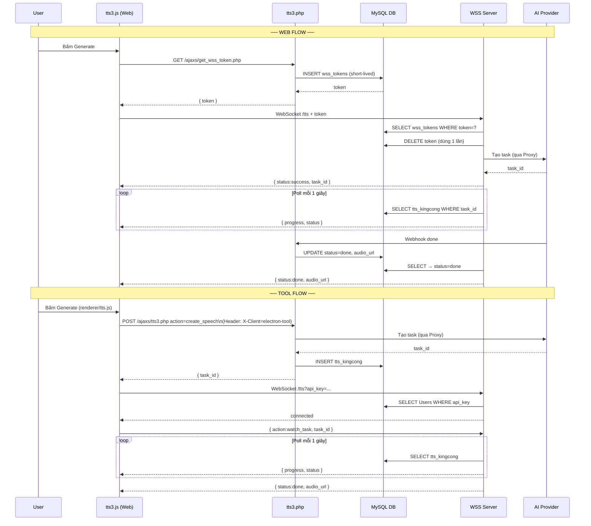
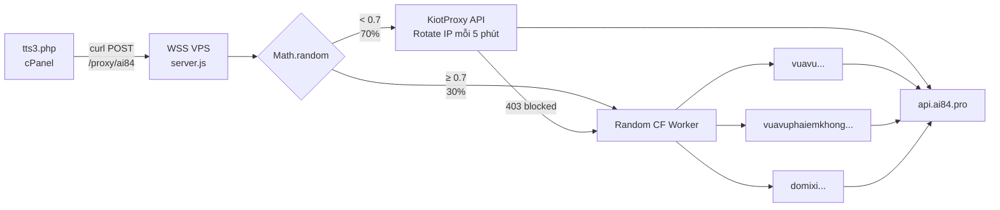

# KingCong TTS System Architecture

## Luồng tổng quan

```mermaid
flowchart TD
    subgraph WEB["🌐 Web (kingcongstudio.com/tts3)"]
        W1[User bấm Generate] --> W2[GET /ajaxs/get_wss_token.php]
        W2 -->|token OK| W3[WebSocket\nwss://wss.kingcongstudio.com:8443/tts]
        W2 -->|token fail| W4[Fallback AJAX POST\n/ajaxs/tts3.php]
        W3 -->|send create_speech| WSS
        W4 -->|POST action=create_speech| PHP
        W3 -->|nhận progress push| W5[Update UI card + progress bar]
        W5 -->|done| W6[Render audio player]
    end

    subgraph TOOL["🖥️ Electron Tool (toolkingcong)"]
        T1[User bấm Generate] --> T2[renderer/tts.js\nelectronAPI IPC]
        T2 --> T3[main.js]
        T3 -->|POST action=create_speech\nHeader: X-Client=electron-tool| PHP
        PHP -->|trả task_id| T3
        T3 -->|watch_task, task_id| TWSS[WebSocket\nwss://wss.kingcongstudio.com/tts\n?api_key=...]
        TWSS -->|nhận progress push| T3
        T3 -->|IPC reply audio_url| T2
        T2 --> T4[Render audio player]
    end

    subgraph PHP["⚙️ PHP — /ajaxs/tts3.php\n(chạy trên cPanel kingcongstudio.com)"]
        PHP1[action=create_speech] --> PHP2{Provider?}
        PHP2 -->|elevenlabs / minimax\nvia AI84| PHP3[callAi84Proxy\ncurl → VPS Proxy]
        PHP2 -->|ai33| PHP4[curl trực tiếp\napi.ai33.pro]
        PHP2 -->|kingcong| PHP5[curl\nmaziao.com API]
        PHP3 --> PHP6[(DB: tts_kingcong\ntask_distribution\napi_keys_pool)]
        PHP4 --> PHP6
        PHP5 --> PHP6
    end

    subgraph VPS["🖧 VPS — wss.kingcongstudio.com"]
        subgraph WSS["WSS Server — wsskingcong/server.js :8443"]
            WSS1[/proxy/ai84\nHTTP POST] --> PROXY
            WSS2[/tts\nWebSocket] --> WSSTTS[routes/tts.js]
        end

        subgraph PROXY["Proxy Router"]
            PR1{Random\n70% / 30%}
            PR1 -->|70%| KIOT[KiotProxy\nRotate IP 5 phút]
            PR1 -->|30%| CF[CF Workers\nRandom 1 trong 3]
            KIOT -->|403 blocked| CF
        end

        subgraph WSSTTS["routes/tts.js — Task Monitor"]
            TTS1[Auth: token / api_key] --> TTS2[watch_task]
            TTS2 --> TTS3{Provider?}
            TTS3 -->|ai84| TTS4[Fake progress\nChờ webhook update DB]
            TTS3 -->|kingcong| TTS5[Poll maziao.com\nmỗi 1s]
            TTS3 -->|ai33| TTS6[Poll api.ai33.pro\nmỗi 1s]
            TTS4 --> TTS7[Push task_update\nqua WebSocket]
            TTS5 --> TTS7
            TTS6 --> TTS7
        end
    end

    subgraph CF_WORKERS["☁️ Cloudflare Workers"]
        CF1[vuavu.buicongxd11.workers.dev]
        CF2[vuavuphaiemkhong.buicongxd11.workers.dev]
        CF3[domixi.buicongxd11.workers.dev]
    end

    subgraph PROVIDERS["🎙️ TTS Providers"]
        P1[AI84\napi.ai84.pro\n11Labs / Minimax]
        P2[AI33\napi.ai33.pro]
        P3[KingCong\nmaziao.com]
    end

    subgraph DB["🗄️ MySQL — LongVân\ncpanelhcm1.longvan.net"]
        DB1[(tts_kingcong)]
        DB2[(task_distribution)]
        DB3[(api_keys_pool)]
        DB4[(wss_tokens)]
        DB5[(Users)]
    end

    PHP3 --> WSS1
    KIOT --> P1
    CF --> CF_WORKERS
    CF_WORKERS --> P1
    PHP4 --> P2
    PHP5 --> P3
    WSSTTS --> DB1
    WSSTTS --> DB2
    WSSTTS --> DB3
    PHP --> DB1
    PHP --> DB2
    PHP --> DB3
    W2 --> DB4
    TTS1 --> DB4
    TTS1 --> DB5

    P1 -->|webhook done| PHP
```

---

## Auth Flow — Web vs Tool



---

## Proxy Layer — AI84



---

## Điểm lỗi thường gặp

| Triệu chứng | Nguyên nhân | Chỗ kiểm tra |
|---|---|---|
| TTS tạo không được | cPanel IP bị block AI84 | `server.js` log KiotProxy |
| Progress bị đứng | WSS mất kết nối DB (ETIMEDOUT) | `pm2 logs wss-kingcong` |
| AI84 trả 403 | KiotProxy hết tiền / key hết hạn | `global.kiotFailed` + CF Worker fallback |
| Token expired | `wss_tokens` không xóa được | DB table `wss_tokens` |
| Tool không nhận progress | main.js WSS disconnect | Electron DevTools console |
| SRT không generate | Background job lỗi | `tts3.php` background curl |
