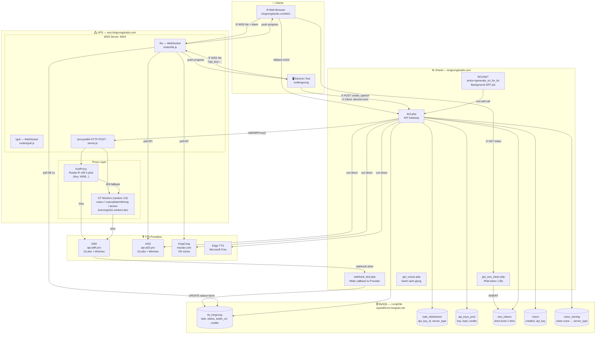
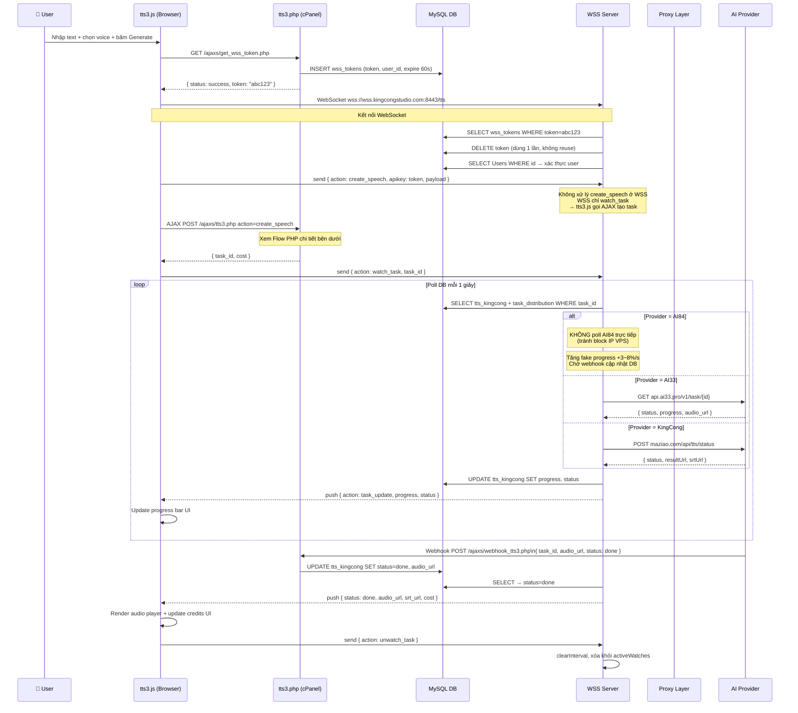
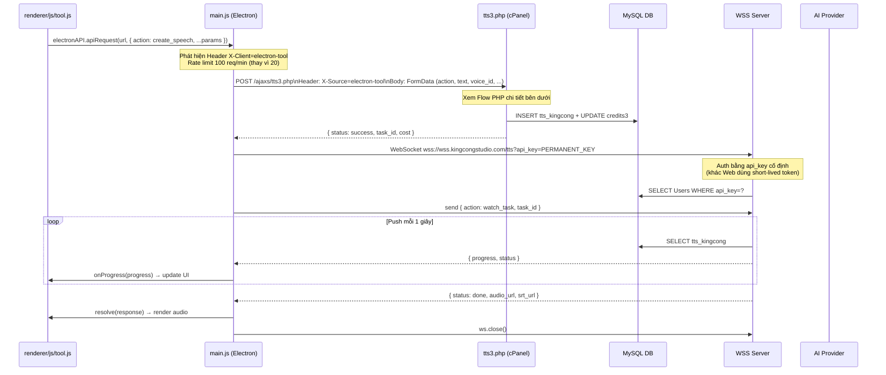
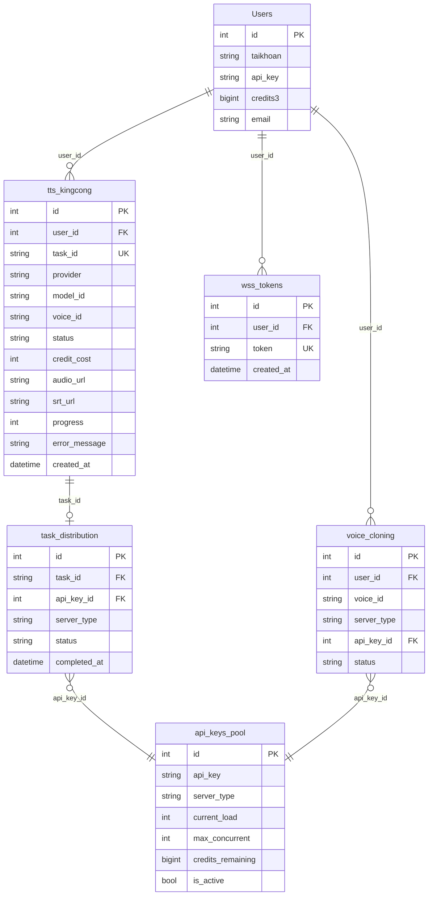

# KingCong TTS — Full System Architecture

## 1. Tổng quan toàn hệ thống



---

## 2. Flow Web — Chi tiết từng bước



---

## 3. Flow Tool Electron — Chi tiết



---

## 4. PHP tts3.php — Logic chọn Server & API Key

```mermaid
flowchart TD
    START[POST action=create_speech] --> AUTH{Session hợp lệ?}
    AUTH -->|No| ERR401[401 Unauthorized]
    AUTH -->|Yes| RATELIMIT{Rate limit check\nWeb: 20 req/min\nTool: 100 req/min}
    RATELIMIT -->|Vượt| ERR429[429 Too Many Requests]
    RATELIMIT -->|OK| COST[Tính credits\nchar × base_rate × cost_factor × clone_multiplier]
    
    COST --> COST_NOTE["base_rate: 1.12 (normal) / 0.35 (EdgeTTS)\ncost_factor: theo model\nclone_multiplier: x1.15 nếu là clone voice\nSRT/transcript: x1.15"]
    COST_NOTE --> CHECK_BAL{credits3 đủ?}
    CHECK_BAL -->|No| ERR402[402 Không đủ credits]
    CHECK_BAL -->|Yes| VOICE_TYPE{Voice type?}

    VOICE_TYPE -->|Clone voice\nCó trong voice_cloning| CLONE_SERVER{Nhiều server?}
    CLONE_SERVER -->|1 server| USE_CLONE_KEY[Dùng api_key_id của clone]
    CLONE_SERVER -->|AI33 + AI84| CLONE_RAND{SRT upload?}
    CLONE_RAND -->|Yes| FORCE_AI33[Force AI33]
    CLONE_RAND -->|No| RAND7030{Random 1-100}
    RAND7030 -->|≤70| USE_AI33[AI33 70%]
    RAND7030 -->|>70| USE_AI84[AI84 30%]

    VOICE_TYPE -->|System voice\nKhông có clone| LB[Load Balancer\ngetAvailableServer]
    LB --> LB_SERVER{Server available?}
    LB_SERVER -->|ai33 / ai84| GET_KEY[getAvailableApiKey\ntheo load + credits]
    LB_SERVER -->|NULL| FB1{Thử server còn lại?}
    FB1 -->|OK| GET_KEY
    FB1 -->|Vẫn NULL| FB2[Final fallback: KingCong]

    GET_KEY --> SEND[Gửi request tới Provider]
    USE_CLONE_KEY --> SEND
    FORCE_AI33 --> SEND
    USE_AI33 --> SEND
    USE_AI84 --> SEND
    FB2 --> SEND

    SEND --> PROV{Provider?}
    PROV -->|elevenlabs/minimax AI84| PROXY[callAi84Proxy\n→ POST /proxy/ai84 trên VPS]
    PROV -->|elevenlabs/minimax AI33| DIRECT33[curl api.ai33.pro]
    PROV -->|kingcong| DIRECTKC[curl maziao.com]
    PROV -->|edge_tts| DIRECTEDGE[curl localhost:5001]

    PROXY --> DB_INSERT[INSERT tts_kingcong\nUPDATE credits3 -cost\nINSERT task_distribution]
    DIRECT33 --> DB_INSERT
    DIRECTKC --> DB_INSERT
    DIRECTEDGE --> DB_INSERT

    DB_INSERT --> SRT_CHECK{with_transcript\nor export_srt?}
    SRT_CHECK -->|Yes| SRT_BG[Background job\ncurl self → generate_srt_for_tts]
    SRT_CHECK -->|No| RESP[Return { task_id, cost }]
    SRT_BG --> RESP
```

---

## 5. Proxy Layer — AI84

```mermaid
flowchart LR
    PHP["tts3.php\ncPanel"] -->|"curl POST\nBearer kc_wss_internal_9x7q2mT4vLpR8nW3"| VPS["server.js\n/proxy/ai84"]

    VPS --> KIOT_CHECK{KiotProxy\ncache < 5 phút?}
    KIOT_CHECK -->|No / expired| KIOT_NEW["GET api.kiotproxy.com/new\n?key=K658..."]
    KIOT_NEW -->|fail < 60s| KIOT_CURR["GET api.kiotproxy.com/current"]
    KIOT_NEW & KIOT_CURR --> KIOT_CACHE["global.cachedProxyAgent\nglobal.lastKiotUpdate"]
    KIOT_CHECK -->|Yes| KIOT_CACHE

    KIOT_CACHE --> RAND{Math.random}
    RAND -->|"< 0.7 (70%)\n+ not failed"| KIOT_SEND["Fetch via HttpsProxyAgent\ntarget_url + api_key"]
    RAND -->|"≥ 0.7 (30%)"| CF_PICK

    KIOT_SEND -->|"HTTP 403"| MARK_FAIL["global.kiotFailed = true"] --> CF_PICK

    CF_PICK["Random 1 trong 3\nCF Workers"] --> CF1["vuavu...workers.dev"]
    CF_PICK --> CF2["vuavuphaiemkhong...workers.dev"]
    CF_PICK --> CF3["domixi...workers.dev"]

    CF1 & CF2 & CF3 -->|"Verify X-Proxy-Secret\nForward request"| AI84["api.ai84.pro"]
    KIOT_SEND --> AI84

    AI84 -->|"{ success, task_id }"| VPS
    VPS --> PHP
```



---

## 6. Database Schema — Các bảng liên quan TTS


